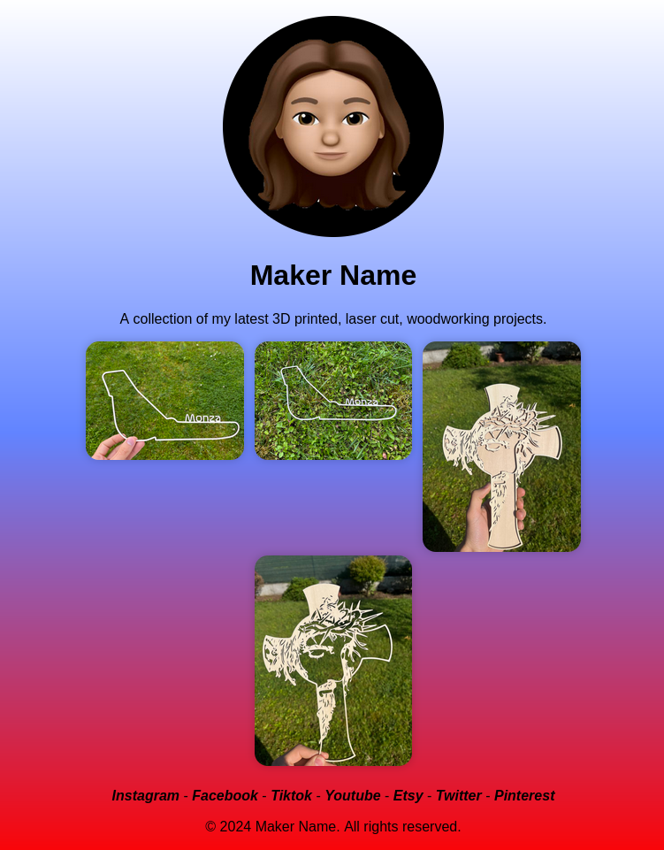

# Maker Showcase Website Template
A simple and responsive HTML template for makers to showcase their projects, work, and products in a Linktree-style page.

## Features
- **Responsive Design**: The template is designed to be responsive, ensuring that it looks great on desktop, tablet, and mobile devices.
- **Gallery**: A simple gallery system allows makers to display their projects with ease.
- **Social Links**: Include links to your social media profiles and connect with your audience.
- **Customizable**: The template is easy to customize with your own content and styles.

## Getting Started
1. **Clone the Repository**: Clone this repository to your local machine using `git clone https://github.com/your-username/maker-showcase-template.git`.
2. **Replace Content**: Replace the placeholder content in the `index.html` file with your own.
3. **Customize Styles**: Customize the styles in the `style.css` file to match your brand.
4. **Host on Vercel**: Host your site on Vercel for free and easily share your showcase with the world.

## Technologies Used
- **HTML**: The template is built using HTML5.
- **CSS**: The styles are written in CSS3.
- **JavaScript**: No JavaScript is used in this template.

## License
This template is licensed under the MIT License. You are free to use, modify, and distribute it as you see fit.

## Credits
- **Your Name**: This template was created by you, a maker and developer.

## Contact
If you have any questions or need help with the template, feel free to reach out to me at [your-email@your-email.com](mailto:your-email@your-email.com).
